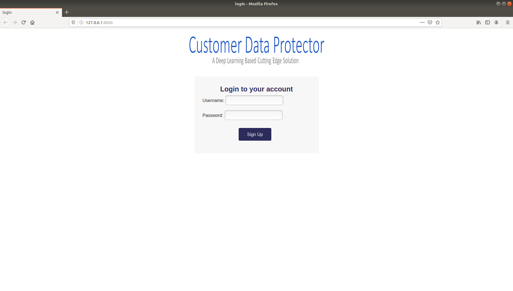
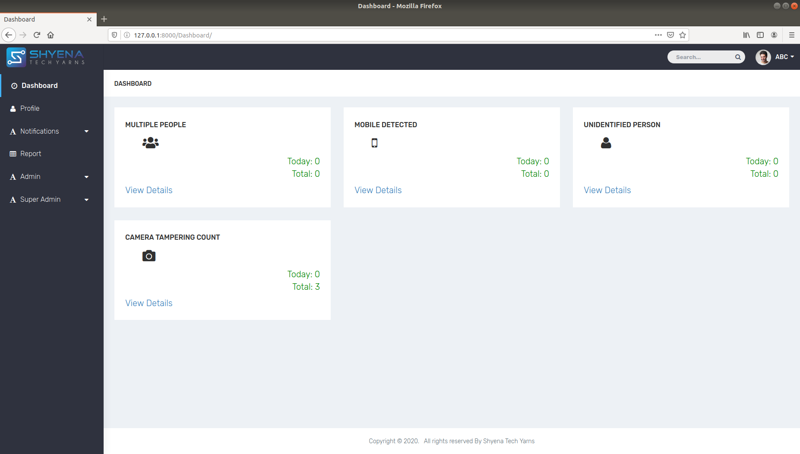
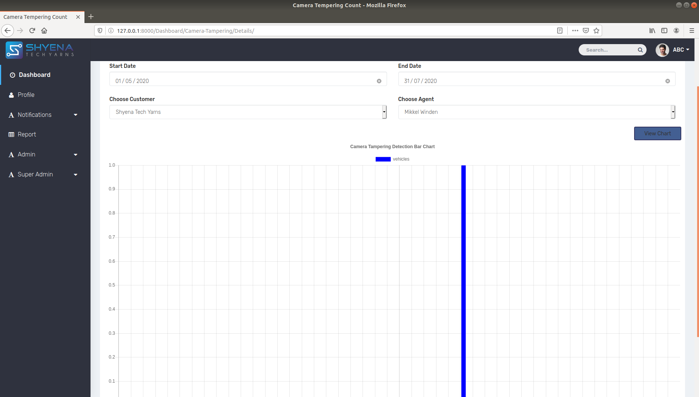

# Customer-Data-Protection

##  Current Business Challenge

The Voice & Back Office Business Processes are very critical to the Customers. In some Processes, extremely sensitive customer data is exposed to the Agents. When the agents
were working from the office premises, all the required security compliances were taken care. The Agents never had access to Mobile Phone, Internet, Notepad, Pen & Paper on the Floor.

However, due to COVID-19, the picture has changed completely. The agents are now working from home. While the organizations have made some or other security arrangements to protect Customers data, but it is still not fool proof.

The agents can access the Customer applications via secured channels from home, however, It does not stop them to take pictures of sensitive data using mobile camera. Neither there is any control on number of people present in the background where the agent is working. The Sensitive information can be leaked by such people. This is a massive risk to business and might result in heavy penalties and negatively impact the brand.

## Customer Data Protection is a Deep Learning based solution with the following benefits:
#### 1. Protect Customers Sensitive Data
#### 2. Recognize Employees
#### 3. Detect Non-employees surrounding the Employee
#### 4. Prohibit Employees from taking pictures of Laptop Screen
#### 5. Real time Alerts when an unknown person is accompanying the employee
#### 6. Blank the Laptop Screen when non-compliance is detected
#### 7. Solutions works on Laptops. Can also be deployed on desktop with a Webcam
#### 8. Solution available on Cloud & On-Premise

## A Few Screenshots:

### 1. Login Page

### 2. Dashboard.png

### 3. Camera Tampering Chart 

